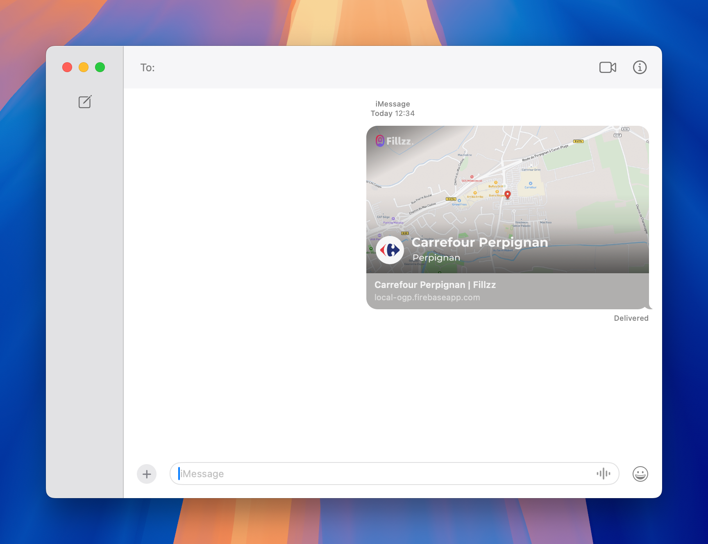

# OpenGraph Map Image Generator

This project provides a community-driven API to generate social media preview images using **Mapbox** and **Cloudflare Workers**.

## Features

- **Edge rendering** with Hono and Cloudflare Workers
- **Mapbox Static Images API** integration
- Built-in caching of fonts and remote images
- Written in **TypeScript** with unit tests

# Example Usage


## Getting Started

```bash
bun install
bun run dev   # start local dev server
bun run deploy # deploy to Cloudflare
```

### Configuration

1. Set `MAPBOX_TOKEN` in `wrangler.toml`:
   ```toml
   [env.production.vars]
   MAPBOX_TOKEN = "your_mapbox_token_here"
   ```

## Map Endpoint

`GET /v1/map`

Generates an OpenGraph image centered on a location.

### Query Parameters

| Name       | Description                                                               |
| ---------- | ------------------------------------------------------------------------- |
| `name`     | Station or location name. Defaults to `Fillzz.com`.                       |
| `city`     | Optional city or region label.                                            |
| `provider` | Provider slug used to display its logo.                                   |
| `lat`      | Latitude of the map center. If omitted the service uses a fallback image. |
| `lng`      | Longitude of the map center.                                              |
| `zoom`     | Zoom level (0–20). Defaults to `15`.                                      |
| `overlay`  | Mapbox overlay string. Defaults to a red pin on the coordinates.          |
| `bearing`  | Camera bearing (0–360). Defaults to `0`.                                  |
| `pitch`    | Camera pitch (0–60). Defaults to `0`.                                     |

### Example

```
/v1/map?name=Station&city=Paris&provider=total&lat=48.86&lng=2.35&zoom=14
```

If `lat` or `lng` are missing, a standard fallback map is returned so that dependent services never break.

Errors are returned as JSON with a suitable status code.

## Caching

Fonts and remote map images are cached using Cloudflare Workers Cache to improve performance.

## Contributing

Contributions are welcome! Feel free to open issues or submit pull requests.

## License

MIT
